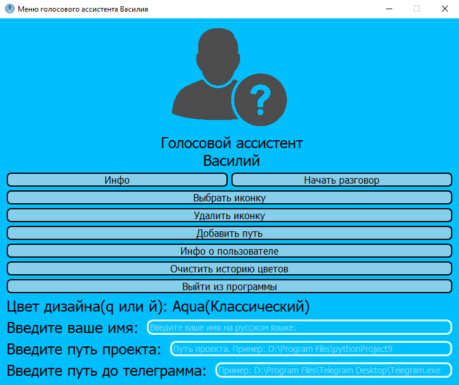
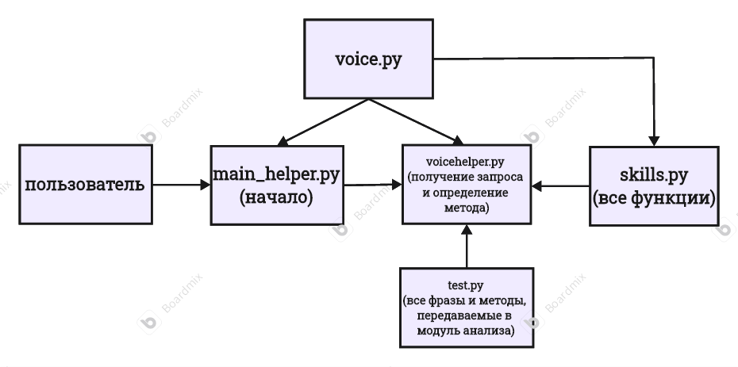
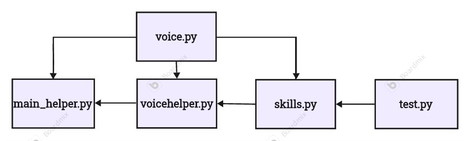
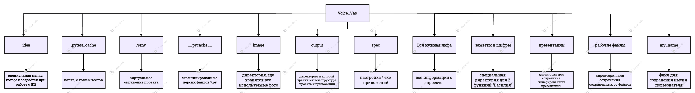
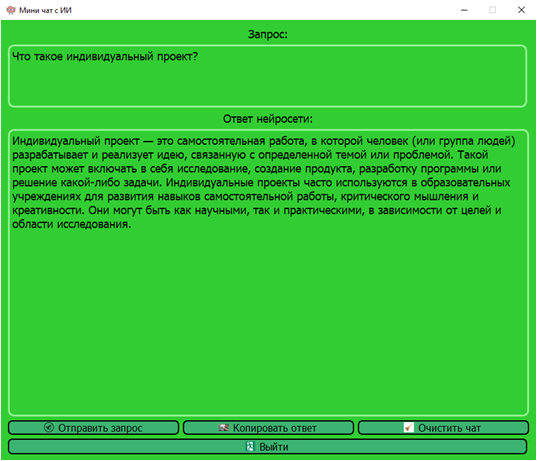
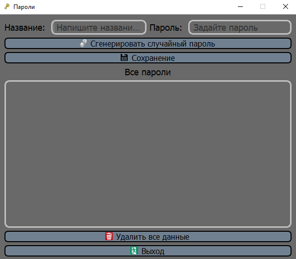
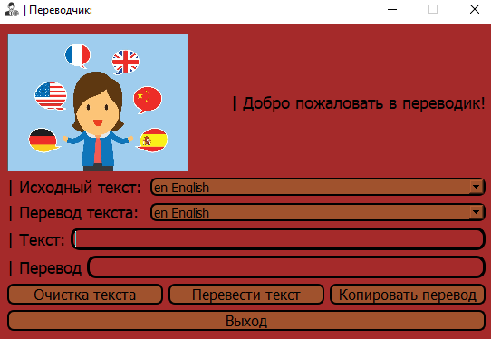

# Голосовой помощник для работы с компьютером **“Василий”**

## Краткое инфо:

Этот репозиторий содержит несколько директорий, которые содержат определённые типы данных для работы проекта.
Все директории и файлы связаны между собой: это обеспечивает корректную и четкую работу голосового ассистента

Основной целью проекта является создание голосового ассистента, который способен упростить человеку работу с ПК.

* _Main_helper.py(Главный интерфейс):_

# Установка:
1) Установите проект **Voice_Vas** на ваш пк
2) Установите голосовую модель yuriy по ссылке [https://rhvoice.su/voices/](#https://rhvoice.su/voices/)
3) Через любой удобный вам редактор кода(можно через cmd) создайте 
виртуальное окружения для проекта: 

    `python -m venv venv`

    `venv\Scripts\activate`

3) Установите все зависимости проекта:

    `pip install -r requirements.txt`
4) Откройте **output -> API_KEY.txt** и введите в файле свой ключ от OpenAI
## Запуск: 

1) Запустите **main_helper.py**. После запуска вы должны увидеть главное меню с голосовым ассистентом, где можно настроить по желанию все, что вам требуется
2) Введите путь проекта и путь до телеграмма в определённых строчках для ввода текста. **Внимание!!!** Путь до телеграмма можно заменить на любой текст, но путь до проекта нужно заполнить обязательно.
3) **Необязательно**. Нажмите на кнопку "**Инфо о пользователе**" и настройте информацию о себе, это нужно для корректной работы некоторых функций проекта. После выберете "**Выбрать иконку**" и установите изображение.
4) **Необязательно**. Выберете дизайн приложения: нажмите клавишу q. Проект имеет 7 вариаций дизайна для удобства, которые подробнее мы рассмотрим позже.
5) Нажмите "**Начать разговор**" и начните работу с Василием!

Также вы можете найти инструкцию по запуску через директорию **"Вся нужная инфа"**:

> **Вся нужная инфа -> как запустить.txt**

## Помощь по командам:

  * Для ознакомления со всеми функциям выберете в проекте:

    > **Вся нужная инфа -> help.txt**

## Основное взаимодействие модулей:
Изначально программа имело всего 5 модулей, которые формировали очень простого голосового ассистента:

* **main_helper.py**: Главный интерфейс проекта, позволяющий пользователю настроит свой профиль и начать диалог с ассистентом
* **voice_helper.py**: "Внутренняя" часть проекта, которая позволяет обрабатывать голос пользователя через модель **Vosk** и получать текст запроса. Также используется библиотека **sklearn**, а именно логической регрессии(LogisticRegression) , которая **позволяет определять запрос пользователя не по конкретным фразам, а по ключевым словам**. К примеру возьмем готовую фразу:
`'открой браузер': 'browser',`. Как мы видим есть фраза и функция. В этом случае пользователю не обязательно контректно произносить данную фразу. Самое главное, чтобы в его фразе было слово "браузер". Это простая конструкция, которая позволить пользователю говорить свободно. Её мы разберём чуть позже
*  **voice.py**: Самый простой и необходимых модуль проекта, который позволят голосовому ассистенту произносить фразы с помощью голосовой модели
* **test.py**: Модуль, в котором хранятся все базовые фразы и функции для взаимодействия с пользователем
* **skills.py**: Файл, хранящий все методы для взаимодействия с пользователем

## Базовый сценарий взаимодействия "Василия" и пользователя:

## Подробности про метод определения фразы по ключевому слову:

Как было сказано ранее, для этого используется логическая регрессия от библиотеки **sklearn**. Теперь разберём алгоритм, используемый в voicehelper.py:

Сначала создается и обучается модель:

    `vectorizer = CountVectorizer()` - создание векторизатора для упрощения анализа фразы

    `vectors = vectorizer.fit_transform(list(test.data_set.keys()))` - получение векторов

    `classifier = LogisticRegression()` - создание модели логической регрессии

    `classifier.fit(vectors, list(test.data_set.values()))` - обучение моделы
    
Затем идёт получение вектора и предсказание фразы:

    `trg = test.TRIGGERS.intersection(data.split())` - получение имени голосового ассистента

    `if not trg: return` - если пользователь не назвал голосового ассистента, то фраза пропускается

    `data.replace(list(trg)[0], '')` - удаление "шума" в фразе

    `test_vector = vectorizes.transform([data]).toarray()[0]` - получение вектора из фразы

    `answer = cif.predict([test_vector])[0]` - предсказание функции

    `func_name = answer.split()[0]` - получение функции для выполнения

## Схема проекта:

* _Схема взаимодействия основных модулей:_

* _Схема всего проекта:_

## Преимущества:

* Василий — это ИИ-ассистент, который управляет функциями ПК (персонального компьютера) по голосовым командам. Он выполняет множество функций с пк, которые описаны в разделе **"Помощь по командам"**
* У Василия есть свой интерфейс и приложения для упрощения работы, по типу: тренажёр печати, математический тренажёр, переводчик, мини генератор списка продуктов, менеджер паролей(также по голосу можно будет узнать свой пароль по голосу) и т.д.
* У Василия есть собственное ИИ. С помощью него вы можете с ним болтать на разные темы, разговаривать как с человеком или же вы можете попросить Василия открыть меню с ИИ чтобы дать более сложные запрос.
* Наличие вариаций дизайна: голосовой ассистент имеет 7 цветов с дизайном: голубой(основной), красный, зелёный, серый, розовый, коричневый, фиолетовый. Также
все встроенные меню будут иметь один цвет, который вы выберете
* Удобное определение метода по ключевым словам
* Взаимодействие с API, которое позволяет получать определённый тип информации для пользователей, например, погоду

## Примеры демонстрации проекта:

* _Нейросеть_

* _Встроенное приложение(мессенджер паролей):_

* _Встроенное приложение(переводчик):_

## Итог:

При проверке функций моего голосового помощника я пришёл к выводу, что достиг цели проекта — создать программу для удобного использования компьютера. Надеюсь, она поможет многим в работе. В будущем планирую добавлять новые функции и оптимизировать ассистента. Создание этого проекта было для меня первым опытом, и хотя это было сложно, я добился результата.

## Лицензия
Этот проект распространяется под лицензией MIT.